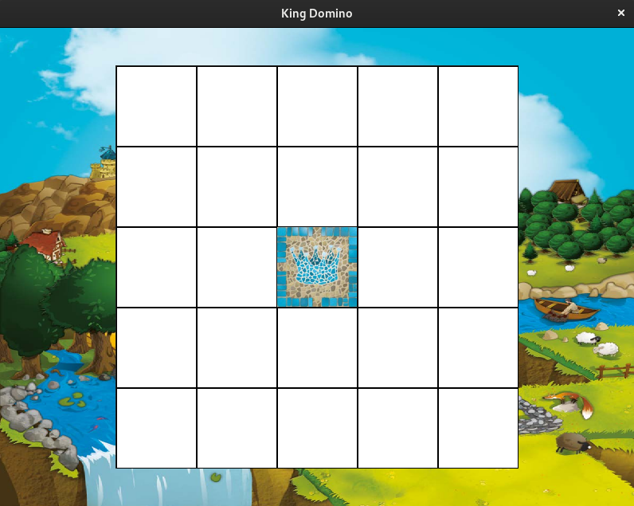

# King Domino



## Comment jouer?

### Contrôles principaux
- 1 : Focus le 1er domino
- 2 : Focus le 2e domino
- 3 : Focus le 3e domino
- 4 : Focus le 4e domino
- r : Tourne le domino
- n : Skip le panneau
- Flèches : Se déplacer
- Space/Enter : Sélectionner ou insérer
- Esc/q : Quitter
- f : Plein écran
- d : Mode débogage

### Contrôles en mode débogage
- p : Affiche le tableau
- j : Affiche le menu
- k : Reconstruit la scène
- l : Affiche le jeu de carte
- t : Redémarre le jeu
- w : Affiche la valeur du plateau
- e : Affiche la scène finale
- Esc/q : Quitter

## Installation

### Sans docker

- Installer [openjdk 11](https://openjdk.java.net/install/)

```sh
./gradlew run # Lance le jeu
```

### Avec docker sur Mac et Linux
```sh
/bin/bash -c "$(curl -fsSL https://raw.githubusercontent.com/Homebrew/install/HEAD/install.sh)" # Installe homebrew
brew install --cask docker # Installe docker
brew install make # Installe make
make docker # Lance le jeu dans un conteneur docker
```
## Règles


